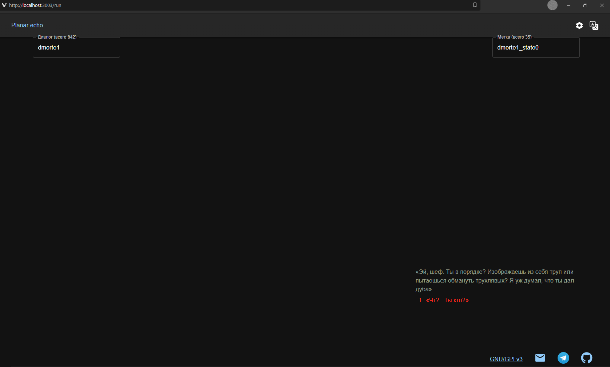

# planar-echo

[\[Русский\]](README.ru.md) \[English\]

Open-source tool to convert **Infinity Engine** game data files you already own into an open format and run them in a custom engine in the browser.

Everything runs locally on your machine.



## Prerequisites

- You **must own** the original game (legally purchased files).
- [Node.js](https://nodejs.org/) and [Yarn](https://yarnpkg.com/) (Yarn 4, see root `packageManager`).
- [WeiDU](https://github.com/WeiDU/weidu) installed locally (used by the conversion pipeline).

No game assets are stored in this repository.

## Legal

Using planar-echo is legal if you own the game. Data never leaves your PC. The project does not distribute copyrighted content, like an emulator.

## Status

Tech demo under active development.

### What works today

- **Game:** Planescape: Torment Enhanced Edition only. Other Infinity Engine games are possible, but not in the nearest roadmap.
- **Conversion** from original binaries to JSON and Ghost modules: `.cre`, `.dlg`, `.eff`, `.ids`, `.ini`, `.itm`, `.tlk`.
- **Supports all available game data localizations:** Russian, English, Czech, German, French, Korean, Polish via original game data.
- **Planar-echo site human-localizations:** Russian, English.
- **Planar-echo site LLM-localizations:** Czech, German, French, Korean, Polish. If these are your native language, please, verify the [translation](planar-shell/src/i18n/lang/).
- **In-browser viewing** of dialogues, creatures and items, binded together with game state logic variables via Ghost bundles served by the backend.
- **Dialogue flow** uses shared `dialogueEngine` (`planar-shared`) and Shell `engine/dialogueLogic.ts` (not a full game simulation yet).

### Close-range roadmap

- Community validation for cs, de, fr, ko, pl UI locales.
- Deeper scripting logic.
- Pack JSON back to BIFF for modding workflows.
- Ship `.sh` / `.exe` / `.apk` artifacts with preconverted content.

## Architecture (five parts)

| Part                 | Role                                                                                       |
| -------------------- | ------------------------------------------------------------------------------------------ |
| **planar-prism**     | CLI: BIFF → JSON → Ghost TypeScript; runs standalone or as a forked child process.         |
| **planar-ghost**     | Output format and on-disk artifacts (your machine); not an npm workspace package.          |
| **planar-shell**     | React + Zustand + MUI UI: conversion wizard, settings, runners for dialogue/creature/item. |
| **planar-asclepius** | Node server: serves Shell (production), Ghost files, REST + WebSocket; orchestrates Prism. |
| **planar-shared**    | Shared types, IPC messages, dialogue engine, mappers.                                      |

**Typical flow**

1. Configure WeiDU, game key/path, and ghost output directory in **Shell** (validated via **Asclepius** REST).
2. Start conversion: Shell opens WebSocket `/api/prism/index`; Asclepius builds Prism, forks it, then runs `build-ghost`.
3. Prism uses WeiDU, writes JSON/Ghost under your ghost directory; progress streams to the UI.
4. Open `/dialogue`, `/creature`, or `/item` in Shell; data is loaded via REST `/api/ghost/*`.

**Ports:** backend `http://localhost:3003`; frontend dev server `http://localhost:3000`.

### Licensing

Repository license is GPL-3.0-or-later.

| Name             | Description             | License                                                |
| :--------------- | :---------------------- | :----------------------------------------------------- |
| planar-asclepius | Backend                 | Repository license                                     |
| planar-prism     | Parser                  | Repository license                                     |
| planar-shared    | Shared library          | Repository license                                     |
| planar-shell     | Frontend                | Repository license                                     |
| planar-ghost     | Built game data on disk | Original game license; not covered by the repo license |

**Do not commit copyrighted game files or contents of your local `planar-ghost` output directory.**

## How to run

### Docker

```bash
docker compose build
docker compose up
```

Open [http://localhost:3003](http://localhost:3003). Mount game and WeiDU paths via `docker-compose.yaml` volumes when you wire your environment.

### Without Docker

1. Install dependencies and build from the repo root:

```bash
yarn
yarn build
yarn start
```

Open [http://localhost:3000](http://localhost:3000) (UI talks to backend at `http://localhost:3003` by default).

## How to contribute

Issues and PRs: [GitHub](https://github.com/snowinmars/planar-echo/).

### Regenerate the Shell API client

After changing REST routes or Zod schemas in **planar-asclepius**:

1. `yarn`
1. `yarn build:shared`
1. `yarn start:asclepius`
1. Open `http://localhost:3003/api/swagger/`
1. Copy its content to `./planar-asclepius/src/swagger/swagger.json`
1. Stop planar-asclepius
1. `yarn workspace @planar/asclepius gen`
