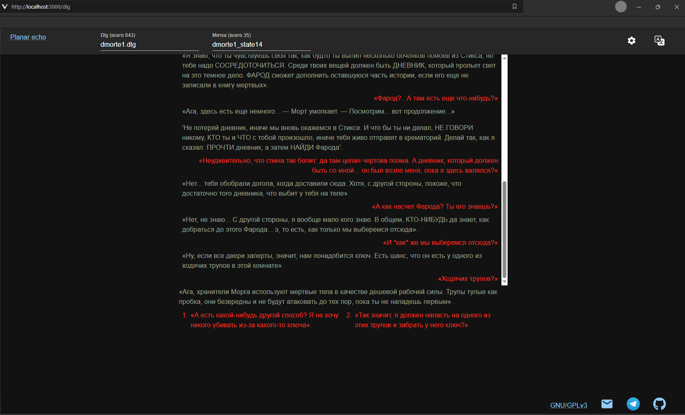
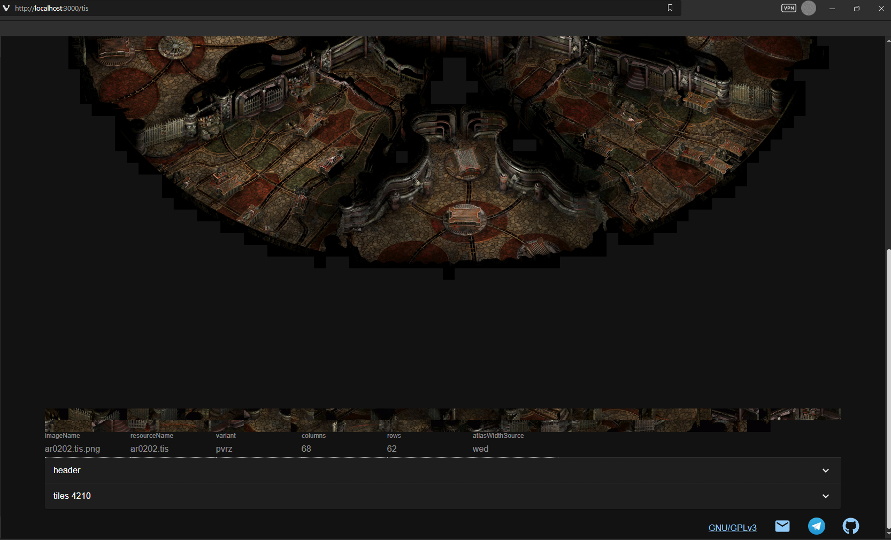

# planar-echo

[Русский] [\[English\]](README.md)

Свободный инструмент для конвертации легально купленных игр **Infinity Engine** в открытый формат и запуска результата конвертации в браузере.

Всё выполняется локально на твоём компьютере.




## Требования

- Вы **должны владеть** оригинальной игрой (легально купить).
- [Node.js](https://nodejs.org/) и [Yarn](https://yarnpkg.com/) (Yarn 4, см. `packageManager` в корне).
- Локально установленный [WeiDU](https://github.com/WeiDU/weidu) (используется в процессе конвертации).

Игровые ассеты в этом репозитории не хранятся.

## Юридические аспекты

Использование planar-echo законно, если вы владеете игрой. Данные не покидают компьютер. Проект, как эмулятор, не распространяет материалы, защищённые авторским правом.

## Статус

Техническая демонстрация в активной разработке.

### Что уже работает

- **Игра:** только Planescape: Torment Enhanced Edition. Другие игры на Infinity Engine возможны, но не сейчас.
- **Конвертация** из оригинальных бинарников в JSON и модули Ghost: `.cre`, `.dlg`, `.eff`, `.ids`, `.ini`, `.itm`, `.tlk`, `.bcs`, `.mos`, `.pvrz`, `.tis`, `.wed`.
- **Поддерживаются все доступные языки игры:** русский, английский, чешский, немецкий, французский, корейский, польский - из оригинальных файлов игры.
- **Локализации интерфейса planar-echo (вручную):** русский, английский.
- **Локализации интерфейса planar-echo (LLM):** чешский, немецкий, французский, корейский, польский. Если это ваш родной язык, пожалуйста, проверьте [перевод](planar-shell/src/i18n/lang/).
- **Просмотр в браузере:**
  - диалогов с:
    - историей
    - логикой состояния игры
  - существ с:
    - кнопкой «говорить», учитывающей веса и логику состояния игры
  - предметов с:
    - кнопкой «говорить», если это возможно
- **Инспекторы в браузере** (структура и картинки, не играбельная карта и не рантайм скриптов):
  - скрипты (`.bcs`)
  - изображения (`.bam`, `.bmp`, `.mos`, `.tis`) как PNG
  - геометрия локаций (`.wed`) и PVR-текстуры (`.pvrz`)
  - звуки (`.acm`, `.mus`, `.wav`)

### Ближайшие планы

- Проверка сообществом shell-локалей cs, de, fr, ko, pl.
- Рендер area в pixi.
- Поставка артефактов `.sh` / `.exe` / `.apk` с предконвертированным контентом.

## Архитектура (пять частей)

| Сервис               | Задача                                                                                     |
| -------------------- | ------------------------------------------------------------------------------------------ |
| **planar-prism**     | CLI: BIFF → JSON → Ghost TypeScript; сам по себе или как дочерний fork-процесс.            |
| **planar-ghost**     | Формат данных и артефакты на диске (на компьютере); не в npm workspace.                    |
| **planar-shell**     | React + Zustand + MUI: мастер конвертации, настройки, просмотр/инспекторы.
| **planar-asclepius** | Node-сервер: Shell (production), Ghost, REST + WebSocket; оркестрация Prism.               |
| **planar-shared**    | Общие типы, IPC, движок диалогов, мапперы.                                                 |

**Типичный поток**

1. В **Shell** укажи путь к WeiDU, путь к файлам игры и каталог ghost.
2. Запусти конвертацию.
3. Prism запишет JSON/Ghost в каталог ghost; прогресс отображается в UI.
4. Открой dev-сервер фронтенда.

**Порты:** backend `http://localhost:3003`; dev-сервер фронтенда `http://localhost:3000`.

### Лицензирование

Лицензия репозитория: GPL-3.0-or-later.

| Название           | Описание                        | Лицензия                                   |
| :----------------- | :------------------------------ | :----------------------------------------- |
| planar-asclepius   | Backend                         | Лицензия репозитория                       |
| planar-prism       | Парсер                          | Лицензия репозитория                       |
| planar-shared      | Общая библиотека                | Лицензия репозитория                       |
| planar-shell       | Frontend                        | Лицензия репозитория                       |
| planar-ghost       | Готовые игровые данные на диске | Лицензия оригинальной игры; не репозитория |

**Не коммить файлы игры с авторским правом и содержимое локального каталога `planar-ghost`.**

## Запуск

### Docker

```bash
docker compose build
docker compose up
```

Открой [http://localhost:3003](http://localhost:3003). Укажи volumes к игре и WeiDU в `docker-compose.yaml`.

### Без Docker

1. Установи зависимости и собери проект из корня репозитория:

```bash
yarn
yarn build
yarn start
```

Открой [http://localhost:3000](http://localhost:3000) (UI по умолчанию обращается к backend на `http://localhost:3003`).

## Чем помочь

Issues и PR: [GitHub](https://github.com/snowinmars/planar-echo/).

### Регенерация API-клиента Shell

После изменения REST-роутов или Zod-схем в **planar-asclepius**:

1. `yarn`
1. `yarn build:shared`
1. `yarn start:asclepius`
1. Открой `http://localhost:3003/api/swagger/`
1. Скопируй содержимое в `./planar-asclepius/src/swagger/swagger.json`
1. Останови planar-asclepius
1. `yarn workspace @planar/asclepius gen`
