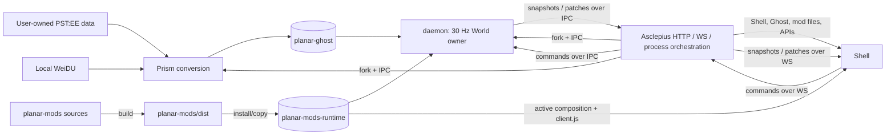

# Modular runtime architecture

This document is the canonical architecture source for the modular planar-echo
runtime. It describes both what exists and what the project is intentionally
building toward.

## Reading rules

- **VERIFIED CURRENT STATE** means behavior or structure present in current sources and manifests.
- **NORMATIVE TARGET ARCHITECTURE** means a stable design decision that may be incomplete or absent.
- A target statement is never evidence that the feature is implemented.
- Coverage claims need current code, tests, or a reproducible observation; a goal is not coverage.
- Exact API payloads and path schemas remain source-defined; this document owns boundaries and invariants.

## Scope and compatibility

### VERIFIED CURRENT STATE

- The seven workspaces are `shared`, `kernel`, `daemon`, `mods`, `prism`, `asclepius`, and `shell`.
- `planar-prism` converts user-owned Infinity Engine data into local Ghost data, modules, and assets.
- PST:EE is the only implemented parser and current reference profile; other game names are rejected.
- Only behavior verified in current source, tests, or manual observations is covered; no broader parity is implied.
- `planar-ghost`, `planar-mods-runtime`, and `planar-weidu` are local, git-ignored data directories.

### NORMATIVE TARGET ARCHITECTURE

- planar-echo is an independent Infinity Engine-compatible platform, not an embedding of the original engine.
- PST:EE is the minimum supported profile and the reference profile.
- Another Infinity Engine game requires an explicit adapter and profile; no other game is promised today.
- Vanilla PST:EE targets observable behavioral parity; differences in verified coverage are bugs.
- Label unverified behavior as unverified; the parity target is not a completeness claim.

## VERIFIED CURRENT STATE: process and data flow



This diagram describes the current process shape, not an authentication,
sandboxing, compatibility, or multiplayer-completeness claim.

## Package ownership

### VERIFIED CURRENT STATE

- `@planar/shared` owns Ghost, mod, host, command, snapshot, patch, and `WorldEffect` contracts.
- `@planar/kernel` owns policy-free `World`, geometry, walk-grid operations, patch folding, and snapshots.
- `@planar/daemon` owns the live `World`, 30 Hz clock, commands, server mods, effects, and daemon IPC.
- `@planar/mods` owns and builds replaceable client/server mods for the default PST:EE composition.
- `@planar/prism` owns user-data-to-Ghost conversion and remains usable as a CLI or through IPC.
- `@planar/asclepius` owns HTTP, WS, local artifact delivery, paths/defaults, and child processes.
- `@planar/shell` owns browser UI, the replicated view, rendering, input, commands, and client-mod loading.

### Dependency direction

Here `A -> B` means that package A may depend on package B:

```text
kernel     -> shared
daemon     -> kernel, shared
mods       -> kernel, shared
prism      -> shared
shell      -> kernel, shared
asclepius  -> daemon, mods, prism, shared, shell
```

The following direction is normative:

- `shared` is the contract base and must not import higher-level packages.
- `kernel` may use shared contracts but must remain free of game policy and I/O.
- `daemon` loads runtime server policy and must not statically depend on default `mods`.
- `shell` must not import Node-only or server-authoritative implementation.
- `prism` must remain independently executable without Asclepius.
- `asclepius` may compose the system; lower packages must not depend on it.
- Local data directories are runtime inputs or outputs, never package dependencies.

## VERIFIED CURRENT STATE: local artifacts and mod layout

- `planar-ghost/` is Prism output consumed by the runtime.
- `planar-weidu/` contains the user's local WeiDU installation.
- `planar-mods-runtime/` is the installed, locally mutable mod runtime.
- `planar-mods/` is source; `planar-mods/dist/` is build output.
- Building `planar-mods` emits `dist/factory-active.json` and one directory per default mod.
- Each built mod directory contains `mod.json` and bundles required by its declared sides:
  - `client.js` for browser-side hooks;
  - `server.js` for daemon-side hooks.
- Installing defaults copies mod directories from `dist` to runtime; these locations are distinct.
- Installation may replace mod directories, but retains `active.json`; factory active is copied only if absent.
- At boot, daemon validates runtime manifests and `active.json`, then imports enabled `server.js`.
- Shell obtains composition and manifests through Asclepius, then imports enabled `client.js`.

### Current manifest and composition concepts

`mod.json` currently records:

- mod ID and version;
- supported side or sides (`client`, `server`);
- exclusive capability slots;
- declared hooks and server queries;
- required mod IDs;
- human-facing description data may also be present.

`active.json` currently records:

- the selected provider for each exclusive slot;
- whether each installed mod is enabled;
- ordered server hook IDs;
- ordered client hook IDs;
- ordered mod IDs for each query.

These are current concepts, not frozen JSON or REST shapes. Shared parsers, validators, and types are exact.

## VERIFIED CURRENT STATE: runtime authority

- Asclepius owns HTTP/WS and forks Prism and daemon; the play WS relays messages without mutating World.
- Daemon owns the live `World`, advances its 30 Hz clock, and emits snapshots, patches, and ticks.
- Server hooks return `WorldEffect`; daemon validates and applies effects as the sole mod-requested writer.
- Server queries derive views such as walk overlays and are not mutation phases.
- Shell folds authoritative snapshots and patches into a client-side replica.
- Client mods run rendering hooks against that replica and browser host APIs.
- Browser input becomes typed commands sent to daemon through the Asclepius relay.
- Current code has no multiplayer mod-hash handshake or hardened multiplayer security boundary.

## NORMATIVE TARGET ARCHITECTURE: modular game composition

- A vanilla or minimally playable game is replaceable mods filling required capability slots.
- Required slots express capabilities, not privileged implementations.
- Default mods provide the PST:EE reference composition, not irreplaceable engine internals.
- Engine mechanisms are World storage, clocks, contracts, hooks, queries, effects, transport, and hosts.
- Vanilla and content-specific policy belongs in profile adapters or mods, not engine infrastructure.
- Stackable diagnostics and overlays need not occupy an exclusive slot.
- A two-sided mod remains separate bundles sharing a manifest, without a client-to-World channel.

## NORMATIVE TARGET ARCHITECTURE: authority and sessions

- Sessions are server-authoritative.
- The daemon is the sole authoritative `World` owner and writer.
- Client mods may render, provide UI, collect input, and form commands only.
- A client command is a request, never a mutation or proof of validity.
- Server mods request mutation only through `WorldEffect`; daemon validates and applies it.
- Asclepius owns session/process orchestration and server-side active composition.
- A session uses one resolved composition; installation edits must not change it mid-flight.
- Multiplayer negotiation will eventually pin mod IDs, versions, and hashes before join.
- A version/hash match establishes artifact identity, not trust or safety.

## Active migration surfaces

The following are **ACTIVE MIGRATION SURFACES**, not stable architecture:

- Paths and defaults, including file defaults, cookies, and derived directories.
- REST request/response DTOs.
- OpenAPI generation and generated Shell clients.
- Mods endpoint paths, payloads, and error shapes.

Agents and developers must verify exact contracts in source. Change these atomically:

1. implementation and shared types;
2. runtime validation/Zod schemas;
3. OpenAPI output;
4. generated Shell clients and call sites;
5. architecture documentation only when a boundary or invariant changed.

Do not preserve stale endpoints because they appear here or document volatile DTOs as stable.

## Security implications

### VERIFIED CURRENT STATE

- Mods are trusted executable JavaScript with no sandbox.
- `server.js` has the Node daemon's ambient filesystem, network, and process permissions.
- `client.js` has the privileges available to application JavaScript in the Shell origin.
- Validation, side declarations, slots, versions, and future hashes do not make code safe.
- Only install mods from sources the user trusts.
- Game paths/assets, Ghost output, WeiDU, and runtime mods remain local and must not be committed.

### NORMATIVE TARGET / non-goals

- Client authority over simulation is not supported.
- Default vanilla policy will not become an unreplaceable engine layer.
- Support for every Infinity Engine game is not a current promise.
- Complete parity is not claimed without verified coverage.
- Sandboxing is not provided or implied by the modular architecture.
- A future sandbox, signatures, or permissions require a separate security design.
- This architecture does not require redistributing original game data.
- Transport DTO stability is not an architecture goal during current migration.

## Operational rules for changes

### Evidence and change discipline

- Label every architecture statement as current evidence or target intent.
- Put a change in the package that owns the affected responsibility.
- Add games through explicit adapters; extending an enum does not add support.
- Update implementation, schemas, OpenAPI, and generated clients atomically.

### VERIFIED CURRENT STATE boundaries

- Keep authoritative World mutation in the daemon.
- Add simulation through server mods and `WorldEffect`, not browser or cross-process mutation.
- Keep client mods limited to presentation, UI/input, and command formation.
- Resolve and validate active composition before session start.
- Treat runtime mod code as trusted until an actual sandbox exists.
- Keep user-owned inputs and generated artifacts out of version control.

### NORMATIVE TARGET ARCHITECTURE pressure

- Put replaceable vanilla behavior in mods, not in `kernel`.
- Keep one resolved mod composition immutable for the lifetime of a session.
